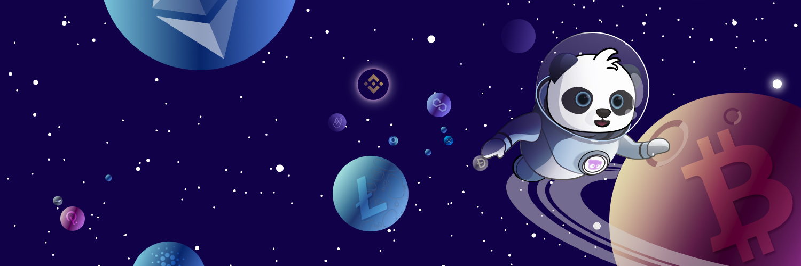

# SpacePanda

## Who are Space Pandas

Space pandas are adventure fanatic who live in the blockchain universe.  They were first discovered by interstellar explorers of blockchain universe in 2021.

Space pandas were born to be a magician, smart and creative. They are always looking into the universe with their big and shining eyes,  discovering the truth of the world.

## Space Panda Land

Space Panda Land is a blockchain world where anyone can earn SPT through skilled gameplay and contributions to the ecosystem. Players can battle with each other,  participate in the interstellar wars, collect and decorate their pets, and build a universe-based kingdom for them.

There are various innovations in Space Panda Land.

#### High-Tech Powered

Space Panda Land uses an universal ERC20 & ERC721 cross-chain technology to simulate a complex universe that human beings live. There exist different blockchain planets, and different space pandas were burn, grow up and live on them. On these beautiful planets, they can travel, earn, make friends, battle, building their home, etc.

#### Fairness

This is a fair world, the game introduce the **Trusted Execution Environment** \(TEE\) technology to make sure that the Space Panda Blind Box is fair to everyone,  any Space Panda creation can be traced and verified by TEE.

#### Highest Safety

Space Panda Land is not only a fun game, it has a cross-chain NFT public chain running behind. It can support Space Panda & SPT to be cross-chain transferred to any major blockchains, such as Ethereum, BSC, Polygon, etc. Any cross-chain transactions can be verified on Space Panda NFT chain

Your Space Pandas will be stored on both the NFT chain and IPFS, which will be permanently available.

#### Social Feature

Space Pandas can be the bridge to your friends, contacts, etc. You can play with the people from social networks and leverage the play to earn characteristics of the game.

\*\*\*\*

