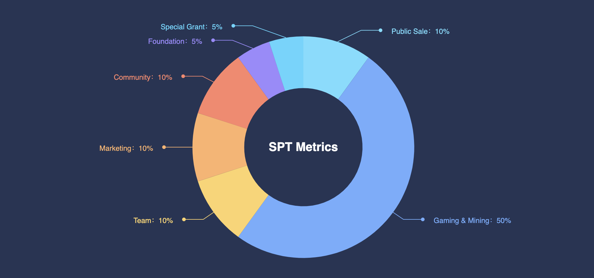

# SPT Token

## What is SP Token \(SPT\)

According to the records of interstellar explorers,  spaces pandas will collect a kind of mysterious mineral resources which are scattered in the universe. The mineral resources is the only acceptable currency in the blockchain universe, and was named by the legend of the space pandas.

SPT is a multi-chain assets, it is first issued on Binance Smart Chain with a total amount 100 million.  SPT can be cross-chain transfer to Ethereum, Polygon, Harmony, Celo, Avalanche, OKEx, xDai, Fantom, HECO, etc. SPT can be used to:

* Naming the space panda.
* Buy food & decorations for space panda.
* Build land-based kingdom for space panda.
* Buy material or resource for battle.
* Buy fuel for interstellar travel \(cross-chain to other blockchain universe\).
* Space panda social activities, such as photographing, holiday event, etc.
* ... more to be discovered.

The SPT token metrics are:

* Total amount of 100 million across all blockchains.
* 50% locked for gaming & mining, will be released gradually according to the gaming contract design.
* 10% for public sale \(12 month linear\).
* 10% for marketing \(36 month linear\).
* 10% for community \(36 month linear\).
* 10% for team \(36 month linear\).
* 5% for foundation \(36 month linear\).
* 5% for special grant \(36 month linear\).

