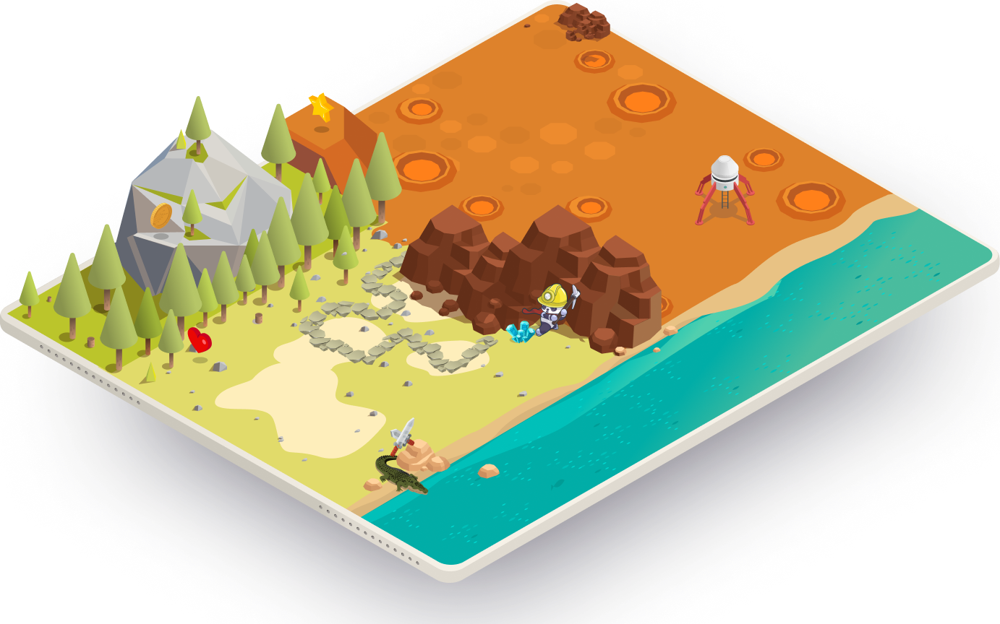
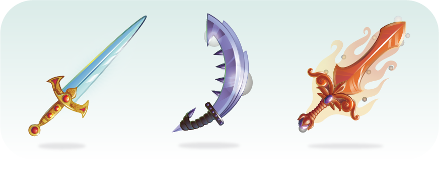
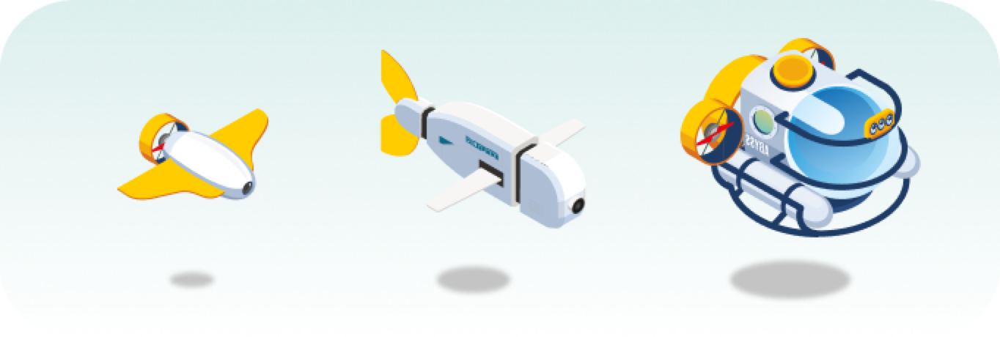
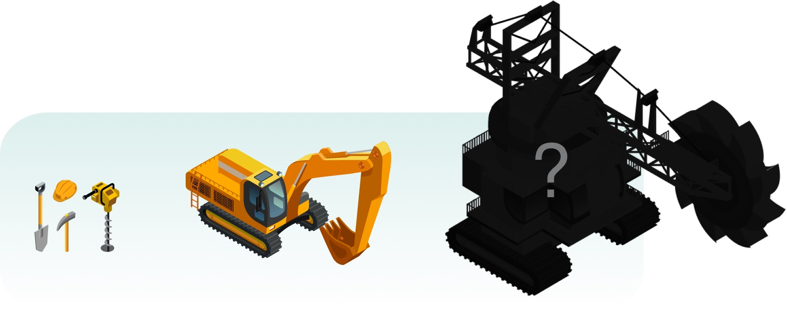
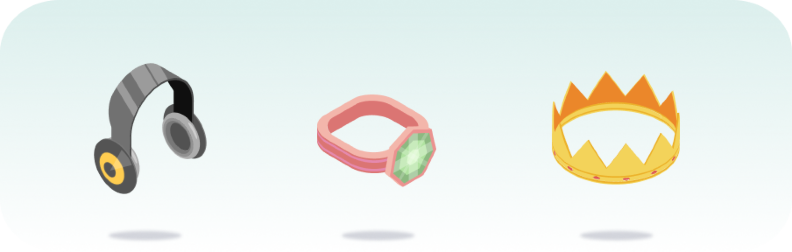
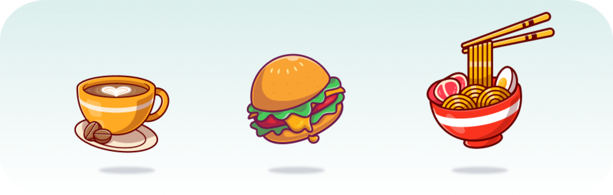

# Gameplay

Space Panda Land is a blockchain universe, where different space pandas were born, grow up and battle. Players can raise a space panda and gain reword through skilled gameplay.

## Stats

Each Space Panda has 6 stats, Health, Strength, Attack, Luck, Speed, Race. Here's what they do:

* Health - The amount of damage your space panda can take before being knocked out.
* Strength - The strength mainly effects the adventure and [SPT](https://docs.pandas.land/economic/spt-token) mining.
* Attack - The damage your space panda can make during a battle.
* Luck - Luck increases critical strike chance.
* Speed - The speed mainly effects the battle and mining.
* Race - Space pandas were born with a race, different race can add different abilities to them.

## Body Parts

Each Space Panda has 6 body parts: eye, mouth, nose, limbs, hair, glow. These body parts can determine the ability value of a space panda. The minimum value of ability is 20, and the maximum is 100.

The ability is very important, it can add extra ratio to Health/Strength/Attach/Luck. The below table shows how the ability works \(suppose the space pandas are only different with ability score\):

| Space Pandas | Health | Strength | Attach | Luck |
| :--- | :--- | :--- | :--- | :--- |
| Ability of 0 | 20 | 30 | 40 | 20 |
| Ability of 20 | 24 | 36 | 48 | 24 |
| Ability of 100 | 40 | 60 | 80 | 40 |

Ability was determined when the space panda was born.

## Races

## **Advanced Mechanics**

There are a lot of tools, weapons and decorations which can be used for the gameplay, and add different stats of your space panda. 

### **Weapons**

Weapons can add the attack score to your space panda. Weapon can add extra Attach Point to your space panda. The better the weapon is, the easier to win the battle.

### **Tools**

These are different transportation tools.  They can add extra Speed Points to your space panda.

There are different mining tools.They can add extra Strength Points to your space panda.

### **Decorations**

Different ****decorations have different functionalities. Some decorations can add Health Points \(HP\), some decorations can add strength, and some very rare decorations even can add Luck Points!

### **Food**

Different foods can add HP or Strength Points to your space panda.

