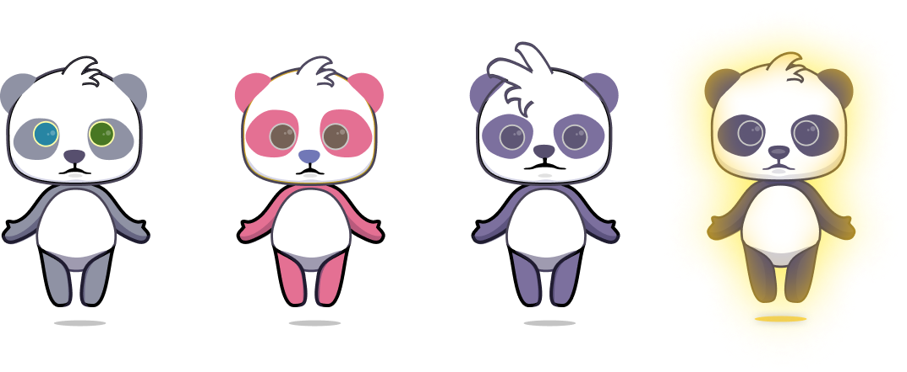

# Space Panda Profile

## Space Panda

Space pandas are lovely interstellar explorers and warriors. Here is an photo of a space panda. 

## Space Panda Features

Different space pandas have difference in color, size, decorations, etc. Details are:

1. **Skin color**:  Theoretically there are 151200 colors as maximum, some colors are rare.
2. **Eye colors**:  Usually the left eye has the same color with the right eye. However, there is a small probability that they have different color. When this happens, the space panda is rare.
3. **Sizes of eyes/mouth/nose**: Their may have different sizes of their eyes, mouth and nose.
4. **Positions of eyes/mouth/nose**: Their may have different positions of their eyes, mouth and nose.
5. **Eye circles**: The angle, position, and distance of the eye circles are different.
6. **Hairs**: Their may have different hairs, and some of them are rare.
7. **Decorations**: Such as space suit, transportation, medal, etc.
8. **Name & birth place**: Different space pandas may be born on different planets, with their unique name.
9. **Glow**: It is super rare that some space pandas were born from noble race,  with glow around their body.
10. .**.. to be continued**

## Space Panda Score

Since different space pandas have difference in various aspects. We introduces a ability score to represent the rarity of them. The space pandas with high ability score will differ in:

1. **High mining speed**: They will get high mining speed for the interstellar mineral resources, and get more Space Token \(SPT\). 
2. **High asset value**：They can be traded on [OpenSea](https://opensea.io/assets) with a high price.

